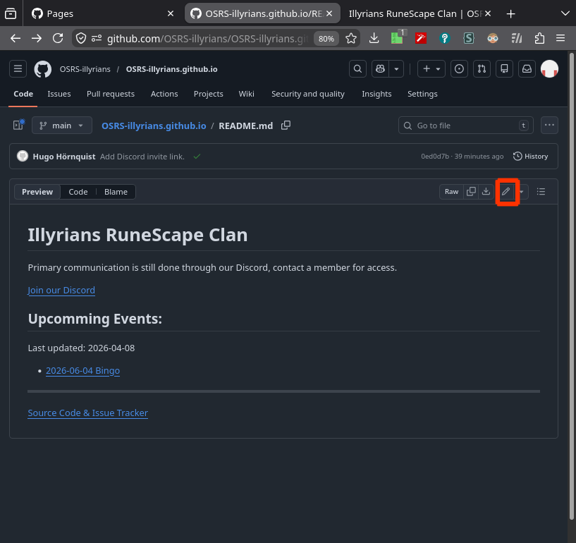
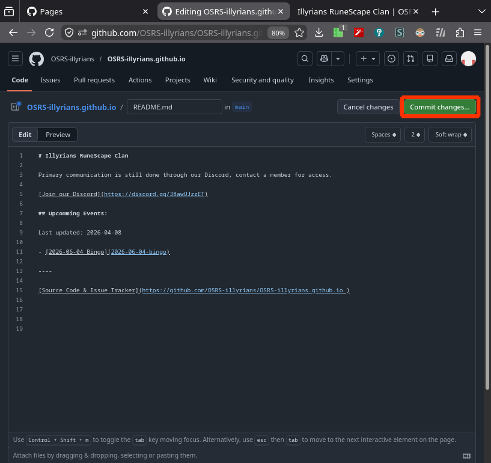

# How to Edit These Pages

Ensure you have a [GitHub](github.com) account, and is signed in to it.
(if you fail here, you shouldn't edit the pages).

If you know [git](https://git-scm.com/), see the official [GitHub Pages guide](https://docs.github.com/en/pages) 
instead, otherwise:

1. Go to the [source code of the website](https://github.com/OSRS-illyrians/OSRS-illyrians.github.io),
  and navigate to the file you want to edit.
  Directories maps to web-pages, and each `README.md` file maps to the contents
  of that page (e.g. the file `something/README.md` will be published as 
  https://osrs-illyrians.github.io/something.
2. Click the edit button
   
3. This text editor uses [markdown](https://github.github.com/gfm/), if unsure,
   put a blank line between paragraphs, and ask for help with formatting.
4. Once done, click the "Commit Changes" button, and preferably write a short
   blurb about why you edited the file.
   
